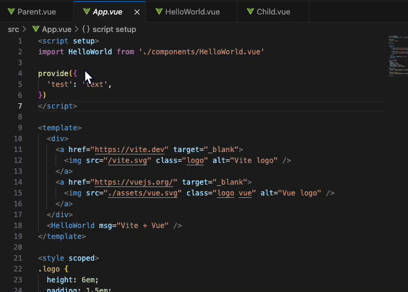

# Vue Provide-Inject Extension


This Visual Studio Code (VSCode) extension enhances your workflow by allowing you to see `provide` values in Vue components. It tracks ancestor components providing values and presents that information directly in your editor (needs to be imported).

The extension is aiming to fix a real problem of mine, missing parent provide(s).

#### Limitation: The provides from node_modules will be ignored for performance. 

---

## Features

1. **Discover Provides**  
   Identify which ancestor components provide values to the current Vue component.

2. **Real-Time Updates**  
   Automatically adapts when Vue files are created, modified, or deleted.

3. **Editor Decorations**  
   Adds decorations to Vue files with hoverable content to display `provide` values.

4. **Smart Syntax Parsing**  
   Supports both object-based and function-based `provide` declarations.



---

## Installation

1. Clone the repository:
   ```shell
   git clone https://github.com/ozJSey/provideSeekerVue
   ```
2. Open the cloned folder in VSCode.
3. Run the extension:
   - Press `F5` in VSCode to launch the Extension Development Host.

---

## Usage

1. Open a `.vue` file in VSCode.
2. Import them from any parent.
3. The extension automatically detects ancestors with `provide` values.
4. View decorations at the top of the editor:
   - Hover over the decoration to see the `provide` details.


### Highlights

- **Regex Parsing**: Efficiently extracts `provide` data from all ancestor Vue files.
- **Caching**: Caches file and ancestor data for optimized performance.
- **DFS Traversal**: Finds all ancestor components providing values.
- **Editor Decorations**: Adds visual cues with hoverable Markdown.

---

## Contributing

Contributions are welcome! Follow these steps:  
- Fork the repository.  
- Make and test your changes.  
- Submit a pull request with a clear description.

---

## License

This project is licensed under the MIT License.

---

## Contact

Feel free to open an issue on the repository for any questions or suggestions.